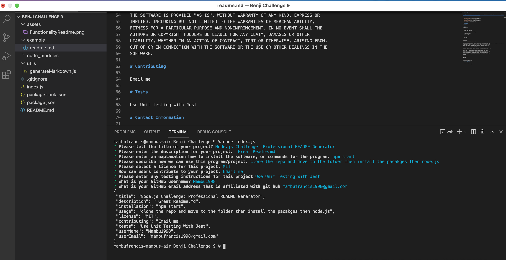

# README Generator: Node.js

A NODE.js application to quickly and easily generate a README file by using a command-line application to generate one. This allows the project creator to dedicate more time working on the Project

When creating an open source project on GitHub, it is important to have a quality README with information about the app--what is the app for, how to use the app, how to install it, how to report issues, and how to make contributions so that other developers are more likely to use and contribute to the success of the project. A command-line application will allow for quick and easy generation of a project README to get started quickly. This will allow a project creator to spend more time working on finishing the project and less time creating a good README.

I created a command-line application that dynamically generates a professional README.md from a user's input using the [Inquirer package](https://www.npmjs.com/package/inquirer). The application will be invoked with the following command:

node index.js

Here is a vide link: <a href="https://drive.google.com/file/d/1M5x5s6Kx1bghMpTmzFPTY4SIR2pJmy-O/view?usp=sharing" target="_blank">Link</a> to a video walkthrough that describes the functionality of my application.

# Application Running in Command Line

Picture for functionality of the program:


# User Story

```
AS A developer
I WANT a README generator
SO THAT can quickly create a professional README for a new project
```

# Acceptance Criteria

```
GIVEN a command-line application that accepts user input
WHEN I am prompted for information about my application repository
THEN a quality, professional README.md is generated with the title of your project and sections entitled Description, Table of Contents, Installation, Usage, License, Contributing, Tests, and Questions
WHEN I enter my project title
THEN this is displayed as the title of the README
WHEN I enter a description, installation instructions, usage information, contribution guidelines, and test instructions
THEN this information is added to the sections of the README entitled Description, Installation, Usage, Contributing, and Tests
WHEN I choose a license for my application from a list of options
THEN a badge for that license is added hear the top of the README and a notice is added to the section of the README entitled License that explains which license the application is covered under
WHEN I enter my GitHub username
THEN this is added to the section of the README entitled Questions, with a link to my GitHub profile
WHEN I enter my email address
THEN this is added to the section of the README entitled Questions, with instructions on how to reach me with additional questions
WHEN I click on the links in the Table of Contents
THEN I am taken to the corresponding section of the README
```

# Application Requirements

- Functional application.

- Here is my <a href="" target="_blank">GitHub Repo Link</a>.

# The generated README includes the following sections:

- Title
- Description
- Table of Contents
- Installation
- Usage
- License
- Contributing
- Tests
- Questions

- The generated README includes a badge that's specific to the repository.

# Environment

- ES6
- NODE.js

# Contributors

- Benji Francis
- GitHub: "https://github.com/mambu1998/Benji-Challenge-9"
